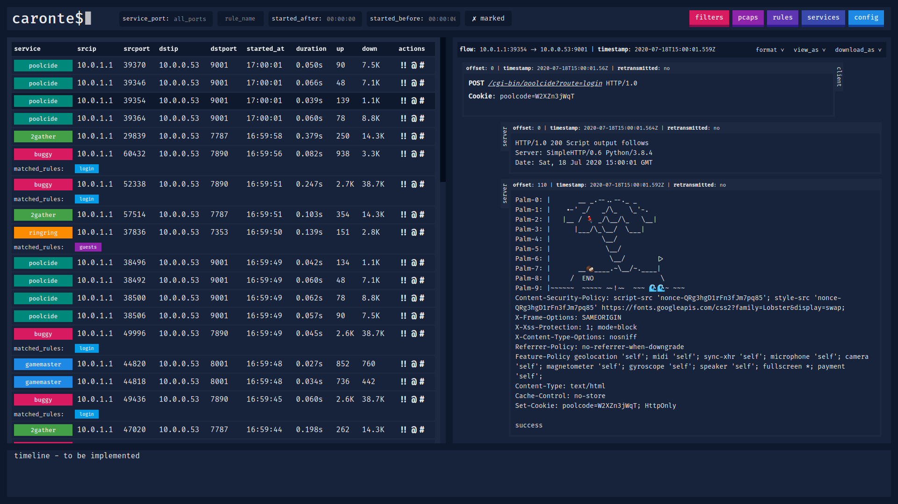
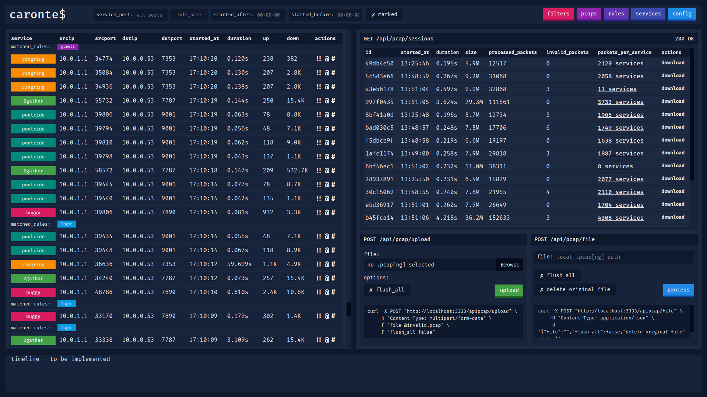
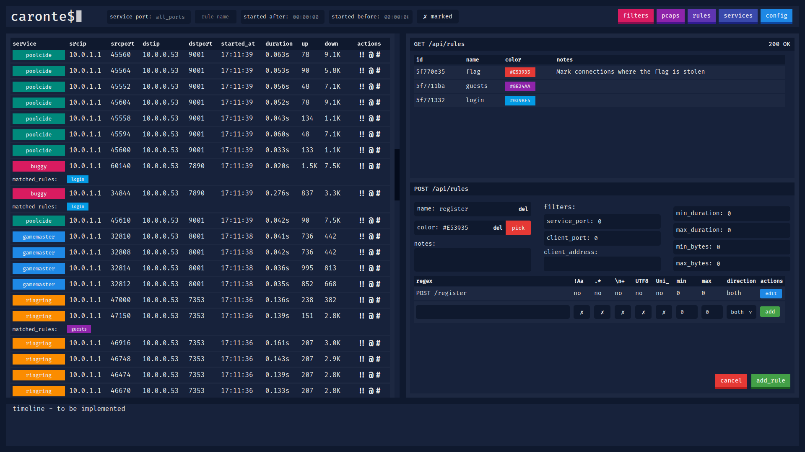
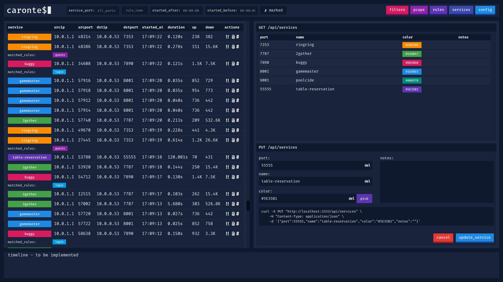

# `caronte$`

[](https://travis-ci.com/eciavatta/caronte)
[](https://codecov.io/gh/eciavatta/caronte)
[](https://www.codacy.com/manual/eciavatta/caronte?utm_source=github.com&amp;utm_medium=referral&amp;utm_content=eciavatta/caronte&amp;utm_campaign=Badge_Grade)


Caronte is a tool to analyze the network flow during capture the flag events of type attack/defence.
It reassembles TCP packets captured in pcap files to rebuild TCP connections, and analyzes each connection to find user-defined patterns.
The patterns can be defined as regex or using protocol specific rules.
The connection flows are saved into a database and can be visualized with the web application. REST API are also provided.

## Features
- immediate installation with docker-compose
- no configuration file, settings can be changed via GUI or API
- the pcaps to be analyzed can be loaded via `curl`, either locally or remotely, or via the GUI
    - it is also possible to download the pcaps from the GUI and see all the analysis statistics for each pcap
- rules can be created to identify connections that contain certain strings
    - pattern matching is done through regular expressions (regex)
    - regex in UTF-8 and Unicode format are also supported
    - it is possible to add an additional filter to the connections identified through pattern matching by type of connection
- the connections can be labeled by type of service, identified by the port number
    - each service can be assigned a different color
- it is possible to filter connections by addresses, ports, dimensions, time, duration, matched rules
- supports both IPv4 and IPv6 addresses
    - if more addresses are assigned to the vulnerable machine to be defended, a CIDR address can be used
- the detected HTTP connections are automatically reconstructed
    - HTTP requests can be replicated through `curl`, `fetch` and `python requests`
    - compressed HTTP responses (gzip/deflate) are automatically decompressed
- it is possible to export and view the content of connections in various formats, including hex and base64

## Installation
There are two ways to install Caronte:
-   with Docker and docker-compose, the fastest and easiest way
-   manually installing dependencies and compiling the project

### Run with Docker
The only things to do are:
-   clone the repo, with `git clone https://github.com/eciavatta/caronte.git`
-   inside the `caronte` folder, run `docker-compose up -d`
-   wait for the image to be compiled and open browser at `http://localhost:3333`

### Manually installation
The first thing to do is to install the dependencies:
-   go >= 1.14 [https://golang.org/doc/install](https://golang.org/doc/install) 
-   node >= v12 [https://nodejs.org/it/download/](https://nodejs.org/it/download/)
-   yarnpkg [https://classic.yarnpkg.com/en/docs/install/](https://classic.yarnpkg.com/en/docs/install/)
-   hyperscan >= v5 [https://www.hyperscan.io/downloads/](https://www.hyperscan.io/downloads/)

Next you need to compile the project, which is composed of two parts:
-   the backend, which can be compiled with `go mod download && go build`
-   the frontend, which can be compiled with `cd frontend && yarn install && yarn build`

Before running Caronte starts an instance of MongoDB [https://docs.mongodb.com/manual/administration/install-community/](https://docs.mongodb.com/manual/administration/install-community/) that has no authentication. _Be careful not to expose the MongoDB port on the public interface._

Run the binary with `./caronte`. The available configuration options are:
```text
-bind-address    address where server is bind (default "0.0.0.0")
-bind-port       port where server is bind (default 3333)
-db-name         name of database to use (default "caronte")
-mongo-host      address of MongoDB (default "localhost")
-mongo-port      port of MongoDB (default 27017)
```

## Configuration
The configuration takes place at runtime on the first start via the graphical interface or via API. It is necessary to setup:
-   the `server_address`: the ip address of the vulnerable machine. Must be the destination address of all the connections in the pcaps. If each vulnerable service has an own ip, this param accept also a CIDR address. The address can be either IPv4 both IPv6
-   the `flag_regex`: the regular expression that matches a flag. Usually provided on the competition rules page
-   `auth_required`: if true a basic authentication is enabled to protect the analyzer
-   an optional `accounts` array, which contains the credentials of authorized users

## Documentation
The backend, written in Go language, it is designed as a service. It exposes REST API that are used by the frontend written using React. The list of available APIs with their explanation is available here: [https://app.swaggerhub.com/apis-docs/eciavatta/caronte/WIP](https://app.swaggerhub.com/apis-docs/eciavatta/caronte/WIP)

## Screenshots
Below there are some screenshots showing the main features of the tool.

#### Viewing the contents of a connection


#### Loading pcaps and analysis details


#### Creating new pattern matching rules


#### Creating or editing services


## License
caronte was created by [Emiliano Ciavatta](https://eciavatta.it) and is licensed under the [GPL-3.0 license](LICENSE).
